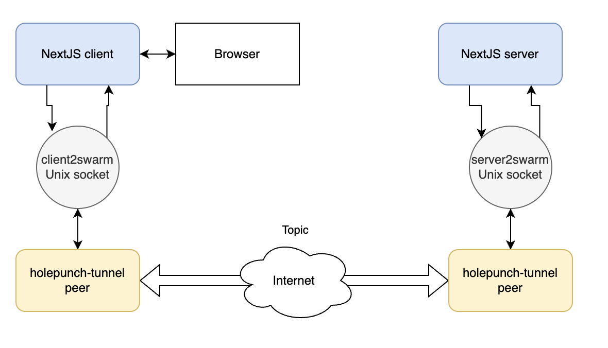

# Health Punch

This is a proof of concept of an end to end typesafe NextJS app built on top of tRPC, tunneled through Holepunch's [Hyperswarm](https://docs.pears.com/building-blocks/hyperswarm).

It implements a simple chat where the user can ask medical questions to an AI powered doctor named Murphy (from "The Good Doctor").

## Why

The [Pear platform](https://docs.pears.com) relies on [Bare](https://github.com/holepunchto/bare), which is a minimal Javascript runtime.

Such runtime is mostly incompatible with Node libraries, making it inconvenient to build modern applications directly on top of it.

This project is an attempt at making NextJS run on top of Bare, isolating the limitations of the Bare runtime to the communication layer and enabling developers to build p2p, censorship resistant, fully fledged web applications using well known, modern libraries and tools for the business logic.

## Architecture

It uses a [custom NextJS server](https://nextjs.org/docs/pages/building-your-application/configuring/custom-server) that delegates the request processing layer to a remote server, reachable via Hyperswarm.

The client connects to a Unix socket (`client2swarm`) and every request is proxied through it.

The remote server does the same (`server2swarm`) and proxies the responses back to it.

A set of 2 Holepunch peers then connect to a specific topic and to the Unix socket above and proxies what's written to the socket to the topic (and vice versa).

This ensures that "client" and "server" can communicate without having to worry about the underlying transport layer.

## Run demo

🎥 [Video demo](https://youtu.be/b-_N3v5Y748)

- Add your [Replicate](https://replicate.com) API key to `.env.`
- Install node-foreman: `npm i -g nf`
- Run: `nf start -f Procfile-tunnel` and wait for the peers to connect
- Run: `nf start -f Procfile-app`

Go to http://localhost:3000 and start chatting with Dr. Murhpy.

The model used is `meta/meta-llama-3-8b-instruct` which is open source and self hostable.

## Future work

- [ ] Support for web sockets (Next's HMR uses them)
- [ ] Self host `meta/meta-llama-3-8b-instruct`
- [ ] Build an API that is compatible with Replicate's SDK (open source)
- [ ] Support persistent through Postgres and embeddings through `pg-vector`
- [ ] Self host model for embeddings
- [ ] Add support for RAG and attachments (PDFs, images, etc.)

## Notes

Please ignore the https://create.t3.gg scaffolding.
